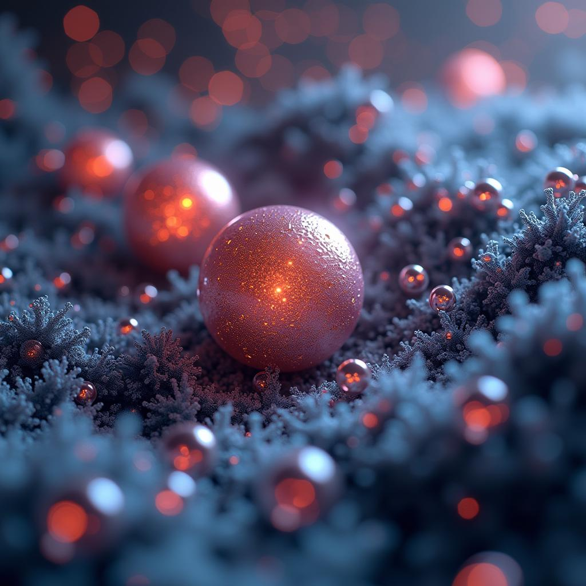

# Trial version of prediction of magnetic properties of nanoparticles, 2023 project. 

The project is a collection of different projects in one large with a large number of descriptors for nanoparticles. The original idea of predicting different parameters for coated and uncoated nanoparticles.

